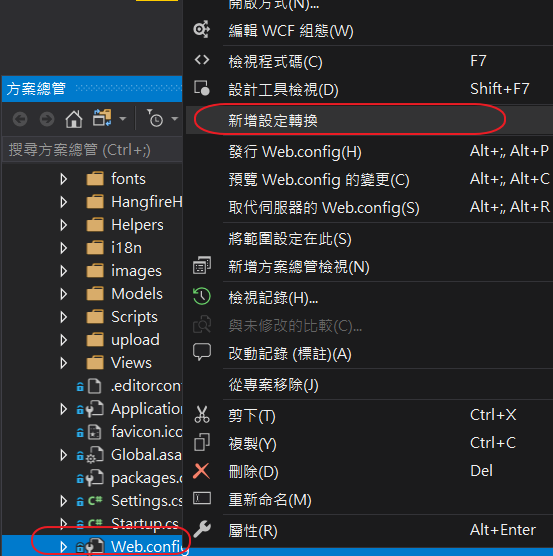

#### 記錄發行檔(MVC版)
目前因為有多國語系的版本，因此每此發行時，要切換不同的設定檔來發行，此發行檔是用於vc2017的MVC版
* 新增組態
  在vc2017裏新加一個設定檔,可以從原來的Release來複制
  繁體
  Release
  Debug
  英文
  En-Release
  簡體
  Cn-Release
  
* 新增設定轉換
  當設定完後接著在web.config檔上按右鍵執行「新增設定轉換」的操作
   

* 修改設定檔
  有要替換的檔案者要修改Web.En-Release.config,Web.Release.config  
  修改資料庫連結的地方
  Web.En-Release.config
  ```
  <connectionStrings>
    <add name="DataModelContainer"
      connectionString="metadata=res://*/DataModel.csdl|res://*/DataModel.ssdl|res://*/DataModel.msl;provider=MySql.Data.MySqlClient;provider connection string=&quot;server=192.168.2.152;user id=userid;password=userpasword;CharSet=utf8;persistsecurityinfo=True;database=Gomo.EnCCDb;allowuservariables=True;minpoolsize=10&quot;" providerName="System.Data.EntityClient"
      xdt:Transform="SetAttributes" xdt:Locator="Match(name)"/>
  </connectionStrings>
  ```
  Web.Release.config  
  ```
  <connectionStrings>
    <add name="DataModelContainer"
      connectionString="metadata=res://*/DataModel.csdl|res://*/DataModel.ssdl|res://*/DataModel.msl;provider=MySql.Data.MySqlClient;provider connection string=&quot;server=192.168.2.152;user id=userid;password=userpasword;CharSet=utf8;persistsecurityinfo=True;database=Gomo.CCDb;allowuservariables=True;minpoolsize=10&quot;" providerName="System.Data.EntityClient"
      xdt:Transform="SetAttributes" xdt:Locator="Match(name)"/>
  </connectionStrings>
  ```
* 修改applicationSettings下面的設定值
  在Web.Config
  例如要修改如下的設定值，在不同的設定下使用
  ```
   <applicationSettings>
    <Ckoil.CC.UI.ConsumerPortal.Properties.Settings>
	  <setting name="ws_server" serializeAs="String">
        <value>192.168.1.888</value>
      </setting>
	</Ckoil.CC.UI.ConsumerPortal.Properties.Settings>
  </applicationSettings>
  ```
  如果要修改Web.En-Release的設定值
  ```
   <applicationSettings>
    <Ckoil.CC.UI.ConsumerPortal.Properties.Settings>
	<setting name="ws_server" serializeAs="String" xdt:Transform="Replace" xdt:Locator="Match(name)">
        <value xdt:Transform="Replace">192.168.1.777</value>
      </setting>
	 </Ckoil.CC.UI.ConsumerPortal.Properties.Settings>
  </applicationSettings>
  ```
* 建立發行檔
  在建立發行檔時，要選擇那一個設定檔
  
### 記錄發行檔(core版) 
    只要在發行檔的設定將資料庫的連接字串，修改儲存即可
  
* [發佈網站時依據組態設定的不同而轉換 Web.Config](http://kevintsengtw.blogspot.tw/2014/08/webconfig.html)